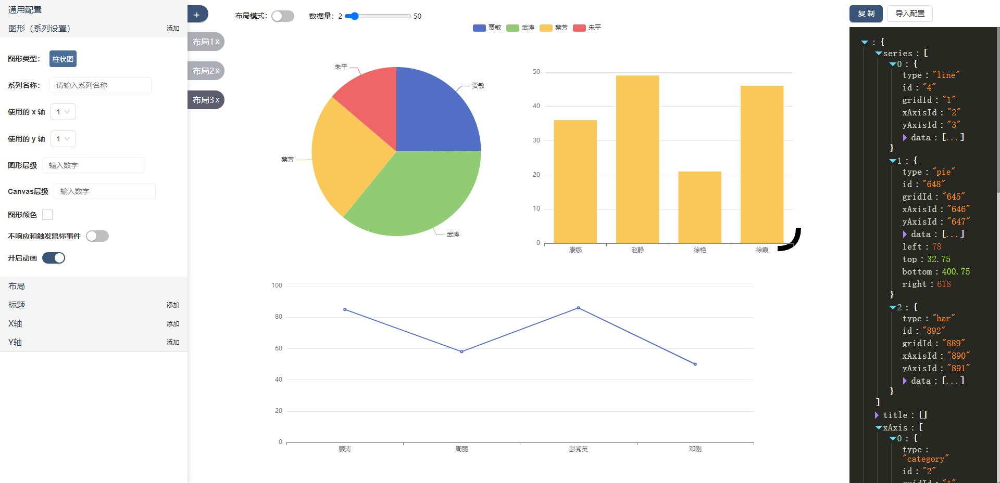

<h1 style="color: transparent;height: 0;">Easy ECharts</h1>

    

🚀访问地址：https://mess663.github.io/easy-echarts/

### 介绍
旨在通过表单、拖拽等方式，快速生成 Echarts 配置，减少配置代码的编写，提高开发效率。标题等文字支持富文本编辑，实时查看配置代码。
### 功能
- 支持的图表类型：折线图、柱状图、饼图、漏斗图、雷达图；
- 支持的组件：Series、Axis（包括横纵）、Title、Grid；
- Grid、Title可拖拽、拉伸；
- 所有组件的文字可通过富文本定义样式；
- 可导出 Echarts 配置，可设置预览数据量；
- 可实时查看配置代码变更；
- 快速导航至官方文档；

### 页面展示

### TODO
- 📈剩余图表类型；
- 🔖部分适合表单配置的组件；
- 🚧优化 UI 样式交互；
- 💬增加交互引导文案；

